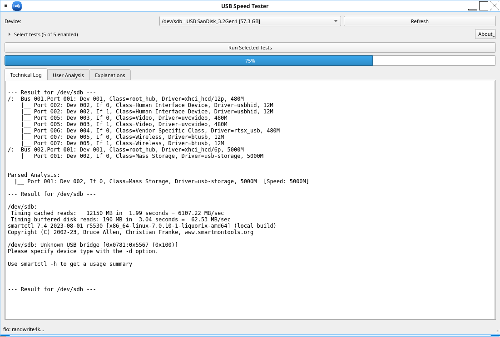

# USB Speed Tester

[](https://www.python.org/)
[](https://pypi.org/project/PyQt6/)
[](LICENSE)
[](https://www.linux.org/)
[](https://peps.python.org/pep-0008/)

A PyQt6 desktop application for analyzing, benchmarking, and diagnosing USB storage devices on Linux. Provides a graphical interface to run common USB diagnostic commands and interpret their results in plain language.

## Features

| Feature | Description |
|---------|-------------|
| **Dynamic Device Detection** | Lists USB storage devices with vendor, model, size, mount point, and negotiated bus speed |
| **Real-time Hotplug Monitoring** | Uses `pyudev` to detect device insertion/removal without UI freezing |
| **Bus Analysis** | Runs `lsusb -t` to show USB topology and negotiated speed (480M vs 5000M) |
| **Read Benchmark** | Executes `hdparm -tT` (via `pkexec`) for cached and physical read speeds |
| **Write Benchmark** | Writes 1 GB test file with `dd` (with space check via `psutil`) |
| **Advanced fio Benchmark** | Sequential + 4K random read/write with IOPS, latency, and throughput |
| **SMART Health** | Runs `smartctl -a` (via `pkexec`) for device health diagnostics |
| **Dual Output Panels** | Technical Log (raw output) + User Analysis (plain-language interpretation) |
| **Explanations Tab** | A Markdown tutorial with diagrams that teaches how to spot a real SuperSpeed port |
| **Collapsible Test List** | The five test checkboxes stay folded into one line and show how many are enabled |
| **About Box** | Author, contact, licence and technologies, with the large application icon and clickable links |
| **Progress Tracking** | Real-time progress bar for long-running tests |
| **Internationalization** | Full Spanish translation included; the UI, the tutorial and the About box all follow the system locale |

## Screenshots

*(Add screenshots here when available)*

## Requirements

### System Dependencies (Linux)
```bash
# Debian/Ubuntu
sudo apt install python3-pyqt6 python3-pyudev python3-psutil \
    util-linux smartmontools fio policykit-1

# Arch Linux
sudo pacman -S python-pyqt6 python-pyudev python-psutil \
    util-linux smartmontools fio polkit

# Fedora
sudo dnf install python3-pyqt6 python3-pyudev python3-psutil \
    util-linux smartmontools fio polkit
```

### Python Packages
```bash
pip install PyQt6 pyudev psutil
```

### Optional (only to work on translations)
```bash
# Debian/Ubuntu
sudo apt install qt6-translations-l10n qt6-tools-dev-tools
# Arch Linux
sudo pacman -S qt6-translations qt6-tools
```
`qt6-translations-l10n` provides Qt's own Spanish strings for the standard
dialogs. The Linguist tools are needed only when regenerating the `.qm`.

## Installation

```bash
git clone https://github.com/wachin/usb-speed-tester.git
cd usb-speed-tester
# Install Python deps (if not using system packages)
pip install -r requirements.txt
```

## Usage

```bash
python3 main.py
```

The interface follows your desktop language (Spanish and English ship today).
To start it in a specific language, see
[Testing another language from the terminal](#testing-another-language-from-the-terminal).



1. Select a USB device from the dropdown
2. Open **Select tests** and untick anything you do not want to run (all enabled by default)
3. Click **Run Selected Tests**
4. View results in the **Technical Log** tab
5. Read plain-language analysis in the **User Analysis** tab
6. Open the **Explanations** tab for the illustrated tutorial on `SS` ports, or the
   **About** menu for author, licence and technology credits

### Test Details

- **Bus Analysis** - No privileges needed. Shows if device negotiated USB 2.0 (480M) or USB 3.x (5000M)
- **Read Benchmark** - Requires root via `pkexec`. Shows cached vs physical read speeds
- **Write Benchmark** - Writes 1 GB file. Checks for 1.5 GB free space first
- **fio Benchmark** - Runs 4 jobs (seq read/write, rand 4K read/write) on 256 MB each
- **SMART Health** - Requires root. May show "not supported" for USB flash drives

## Project Structure

```
usb-speed-tester/
├── main.py              # Complete application (single-file for simplicity)
├── Makefile             # translation/install/uninstall/clean/check targets
├── assets/
│   ├── svg/             # Editable vector sources of the tutorial diagrams
│   │   ├── usb3-ss-logo.svg      # SS + USB trident SuperSpeed emblem
│   │   ├── usb3-ss-ports.svg     # Two SS ports vs. a USB 2.0 port
│   │   └── usb3-ss-laptop.svg    # SS marking engraved next to a laptop port
│   └── icon/            # Application icon: vector source + generated sizes
│       ├── usb-speed-tester.svg
│       └── usb-speed-tester-<size>.png    # 16, 24, 32, 48, 64, 128, 256
├── tutorial/            # One folder per language for the Explanations tab
│   ├── EN/
│   │   ├── tutorial.md           # The tutorial itself
│   │   └── usb3-ss-*.png         # Diagrams, linked relatively
│   └── ES/
│       ├── tutorial.md           # Spanish translation
│       └── usb3-ss-*.png
├── data/                # Files installed outside the program directory
│   ├── io.github.wachin.USBSpeedTester.desktop
│   ├── io.github.wachin.USBSpeedTester.metainfo.xml
│   └── usb-speed-tester.1        # Manual page
├── debian/              # Debian source package (see "Debian packaging")
├── tools/
│   └── svg_to_png.py    # Regenerates every PNG above from the SVG sources
├── .gitignore
├── LICENSE
├── README.md
└── translations/        # Qt Linguist catalogues
    ├── usbtester_es.ts  # Spanish source (editable)
    └── usbtester_es.qm  # Spanish compiled (loaded at runtime)
```

At runtime the program looks for `assets/`, `tutorial/` and `translations/`
next to itself, then in `../share/usb-speed-tester`, then in
`/usr/local/share/usb-speed-tester` and `/usr/share/usb-speed-tester`. Set
`USB_SPEED_TESTER_DATA` to override the search. This is what lets the same
source tree work as a checkout, as a `make install` and as a Debian package.

## Tutorial (Explanations tab)

The **Explanations** tab renders `tutorial/<LANG>/tutorial.md` as Markdown,
together with the diagrams stored in the same folder. The folder is picked from
the system locale: Spanish systems open `tutorial/ES`, anything else falls back
to `tutorial/EN`.

To add another language, copy the `tutorial/EN` folder, translate
`tutorial.md`, and run the converter — it refreshes every
`tutorial/<LANG>` folder it finds:

```bash
cp -r tutorial/EN tutorial/FR
# translate tutorial/FR/tutorial.md
python3 tools/svg_to_png.py
```

## Diagrams and icons

The diagrams are drawn as SVG and shipped as PNG, because a PNG carries its own
glyphs: the labels can never shift or disappear because a font is missing on
the machine running the program. The same applies to the application icon.

Edit the SVG sources, then regenerate every PNG:

```bash
python3 tools/svg_to_png.py              # diagrams (1x + 2x) and the app icon
python3 tools/svg_to_png.py --list       # preview without writing anything
python3 tools/svg_to_png.py --scales 1,2,3   # add even sharper variants
python3 tools/svg_to_png.py usb3-ss-logo.svg # only one diagram
python3 tools/svg_to_png.py --no-icon    # diagrams only
python3 tools/svg_to_png.py --clean      # drop stale PNGs first
```

Diagram files are written as `name.png` at scale 1 and `name@2x.png` for larger
scales. The tutorial links the plain name; at runtime the application picks the
smallest variant that still covers the screen's device pixel ratio, and falls
back to the SVG source if no PNG has been generated yet. Keep scale 1 in
`--scales`, since that is the file the Markdown points at.

> **Tip:** QtSvg (used by the converter and by that fallback) does not
> implement every SVG feature. In particular it ignores `<tspan>` elements that
> carry their own `y` coordinate, so a multi-line text block written by Inkscape
> collapses into a single line. Give each line its own `<text>` element.

## Internationalization (i18n)

Every UI string goes through `self.tr()`, so the interface follows the system
locale. **Spanish is fully translated** (81 strings) and ships ready to use:

| File | Role |
|------|------|
| `translations/usbtester_es.ts` | Editable source, open it with Qt Linguist |
| `translations/usbtester_es.qm` | Compiled translation loaded at runtime |

`TranslationManager` looks for `usbtester_<locale>.qm` using the full locale
(`es_EC`) first and the bare language (`es`) second, so one file covers every
Spanish-speaking region. It also loads Qt's own `qtbase_<language>.qm`, which
translates the standard buttons such as *Close* → *Cerrar*. The tutorial and the
About box follow the same locale.

To add another language:

```bash
# 1. Extract the strings into a new catalogue
pylupdate6 main.py -ts translations/usbtester_fr.ts

# 2. Translate it (Qt Linguist is the friendliest option)
linguist-qt6 translations/usbtester_fr.ts

# 3. Compile it — the application picks it up on the next start
lrelease translations/usbtester_fr.ts

# 4. Copy tutorial/EN to tutorial/FR and translate tutorial.md
cp -r tutorial/EN tutorial/FR
python3 tools/svg_to_png.py      # gives tutorial/FR its diagrams
```

Re-running `pylupdate6` on an existing `.ts` merges the new strings and keeps
the translations you already made, so it is safe to repeat after editing
`main.py`.

### Testing another language from the terminal

The interface, the tutorial and the About box all follow the system locale, so
you can try any language without touching the code:

```bash
# Run in English, whatever your desktop language is
LANGUAGE=en python3 main.py

# Back to your normal language
python3 main.py
```

> **Important:** use `LANGUAGE`, not `LANG`. Qt gives `LANGUAGE` priority over
> `LANG` and `LC_ALL`, and many desktops export a `LANGUAGE` value
> (for example `LANGUAGE=es_EC:es`), so overriding only `LANG` has no effect.

| Command | Locale seen by the app |
|---------|------------------------|
| `python3 main.py` | your desktop locale, e.g. `es_EC` |
| `LANGUAGE=en python3 main.py` | `en_US` |
| `LANGUAGE=en_US.UTF-8 python3 main.py` | `en_US` |
| `LC_ALL=C LANG=C python3 main.py` | `C` (also English) |

English is the language the strings are written in, so there is no
`usbtester_en.qm`: with an English locale no translator is installed at all and
the Qt standard buttons (*Close*, *Cancel*) also stay in English.

## Architecture

```
MainWindow
├── DeviceMonitor (QThread)     # pyudev hotplug monitoring
├── BusAnalysisWorker (QThread) # lsusb -t
├── ReadBenchmarkWorker (QThread)   # hdparm -tT via pkexec
├── WriteBenchmarkWorker (QThread)  # dd with progress
├── FioBenchmarkWorker (QThread)    # fio JSON output
└── SmartHealthWorker (QThread)     # smartctl -a via pkexec
```

All workers inherit from `BaseTestWorker` which provides:
- `progress` signal (percent, message)
- `finished` signal (device_id, output)
- `error` signal (message)
- Cancellation support

## Debian packaging

The `debian/` directory holds a complete Debian source package following
Policy 4.7.4, `debhelper` compat 13 and the DEP-5 machine-readable copyright
format. The binary package installs:

| Path | Contents |
|------|----------|
| `/usr/bin/usb-speed-tester` | The program |
| `/usr/share/usb-speed-tester/` | `assets/`, `tutorial/` and `translations/` |
| `/usr/share/applications/io.github.wachin.USBSpeedTester.desktop` | Menu entry |
| `/usr/share/metainfo/io.github.wachin.USBSpeedTester.metainfo.xml` | AppStream metadata |
| `/usr/share/icons/hicolor/<size>/apps/io.github.wachin.USBSpeedTester.png` | Icons (7 sizes) |
| `/usr/share/man/man1/usb-speed-tester.1.gz` | Manual page |

Build it with:

```bash
sudo apt install debhelper dh-python qt6-l10n-tools lintian devscripts
dpkg-buildpackage -us -uc          # source + binary, output lands in ..
lintian ../usb-speed-tester_1.0.0-1_amd64.changes
```

`debian/rules` delegates to the upstream `Makefile`, so the package and a plain
`sudo make install` produce exactly the same layout. The compiled `.qm`
translations are regenerated from the `.ts` catalogues during the build.

### Before uploading to Debian

1. **File an ITP** (Intent To Package) bug against the `wnpp` pseudo-package,
   for example with `reportbug --kinds=wnpp`, and add its number to
   `debian/changelog` as `* Initial release. (Closes: #1234567)`. Lintian
   currently warns `initial-upload-closes-no-bugs` until that is done.
2. **Tag the upstream release** so `debian/watch` can find it, for example
   `git tag -s v1.0.0 -m "usb-speed-tester 1.0.0"`, and push the tag.
3. **Push an `debian/latest` branch** (see `debian/gbp.conf`) if you want to
   build with `gbp buildpackage`.
4. **Find a sponsor**: publish the package on
   [mentors.debian.net](https://mentors.debian.net/) and request sponsorship on
   the `debian-mentors` mailing list.

Lintian is clean apart from those two upload-time items:

```
W: initial-upload-closes-no-bugs        # fix by filing the ITP
W: newer-standards-version 4.7.4        # trixie's lintian is older than Policy 4.7.4.1
```

## Troubleshooting

| Issue | Solution |
|-------|----------|
| "pkexec not found" | Install `policykit-1` or `polkit` |
| "hdparm: NOT_IOCTLABLE" | Unmount device first or check permissions |
| "fio timed out" | Reduce test size or increase timeout in code |
| "SMART not supported" | Normal for USB flash drives |
| Device not detected | Check `lsblk` and `lsusb -t` manually |
| Bus speed shows Unknown | Requires udev access to USB device ancestors |

## License

GNU General Public License v3.0 - see [LICENSE](LICENSE) for details.

Copyright © 2026 Washington Indacochea Delgado · linuxfrontier@proton.me

## Contributing

1. Fork the repository
2. Create a feature branch (`git checkout -b feature/amazing-feature`)
3. Commit changes (`git commit -m 'Add amazing feature'`)
4. Push to branch (`git push origin feature/amazing-feature`)
5. Open a Pull Request

## Acknowledgments

- [PyQt6](https://www.riverbankcomputing.com/software/pyqt/) - Qt6 Python bindings
- [pyudev](https://pyudev.readthedocs.io/) - Linux device monitoring
- [psutil](https://psutil.readthedocs.io/) - System and process utilities
- [fio](https://fio.readthedocs.io/) - Flexible I/O tester
- [smartmontools](https://www.smartmontools.org/) - SMART monitoring tools