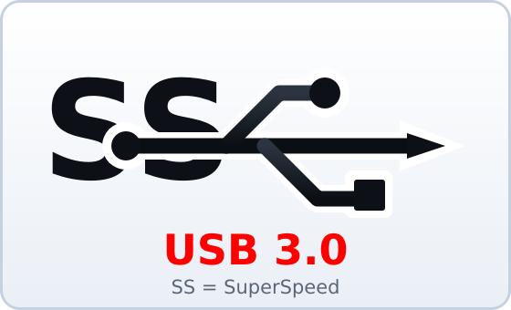
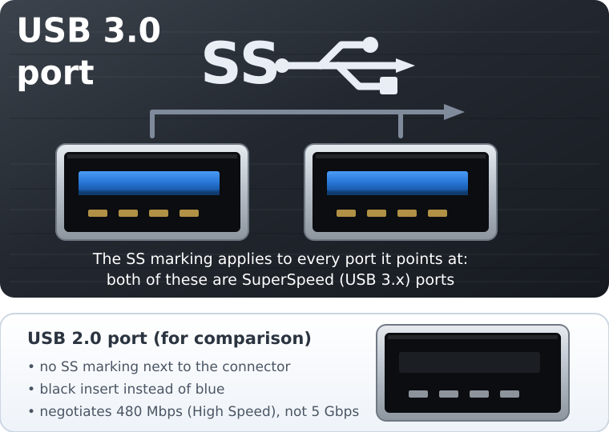
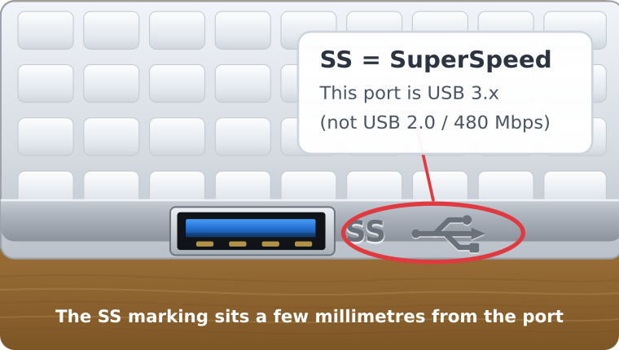

# How to recognise a SuperSpeed (USB 3.x) port

When the **Technical Log** reports `5000M`, the port and the device agreed to
talk at **USB 3.x SuperSpeed — 5 Gbps**. That is the good news. This tutorial
shows you how to *see* that port with your own eyes, so you can plug a fast
drive into the right socket every time.

The trick is a small marking printed or engraved **a few millimetres from the
connector**: the letters **SS**, for *SuperSpeed*.

---

## 1. The SS + USB trident symbol

This is the exact symbol to look for. It combines the two letters **SS** with
the USB trident logo:

You will find it on the plastic of the port, on the chassis next to it, or on
the sticker under the laptop. On many machines the plastic tongue *inside* the
port is also **blue** instead of black.

---

## 2. One marking can cover several ports

Manufacturers often print the symbol only once and use a bracket or an arrow to
show which ports it applies to. Every port the bracket points at is SuperSpeed:

| Marking next to the port | Insert inside the port | Link speed |
|--------------------------|------------------------|------------|
| **SS** + USB trident     | blue                   | 5 Gbps (5000M) |
| no marking               | black                  | 480 Mbps (USB 2.0) |

---

## 3. Look at the side of your own laptop

On a laptop the marking is engraved on the chassis, right next to the
connector. It is small, so lean in and look carefully:

If the port you used has no **SS** marking, the device can only negotiate USB
2.0 — no matter how good the drive is.

---

## Why does a fast port still read slowly?

A SuperSpeed link only sets the *ceiling*. The real speed comes from three
different things, and the program measures each one separately:

- **The bus analysis** (`lsusb -t`) tells you which ceiling was negotiated:
  `5000M` for USB 3.x, `480M` for USB 2.0.
- **The read benchmark** (`hdparm`) and the **fio** numbers tell you how fast
  the flash chip actually is. A cheap flash drive on a perfect USB 3 port often
  reads at 60–150 MB/s and writes at 15–25 MB/s. That is the memory, not the
  port.
- **The write benchmark** (`dd`) matters because writing to flash needs
  erase-and-program cycles, which is why write speeds are always much lower
  than read speeds on consumer drives.

So a drive that reads at 58 MB/s on a `5000M` port is not broken: the port is
fine and the flash chip is the limit.

---

## Quick checklist

1. Find the **SS** marking next to the port you want to use.
2. Prefer the port with the **blue** insert.
3. Plug the drive in and run **Bus Analysis** — it must report `5000M`.
4. Compare the read and write numbers with the ranges above.
5. If the analysis reports `480M`, move the drive to another port on the same
   machine; the cable, a hub or the drive itself may also be the cause.
